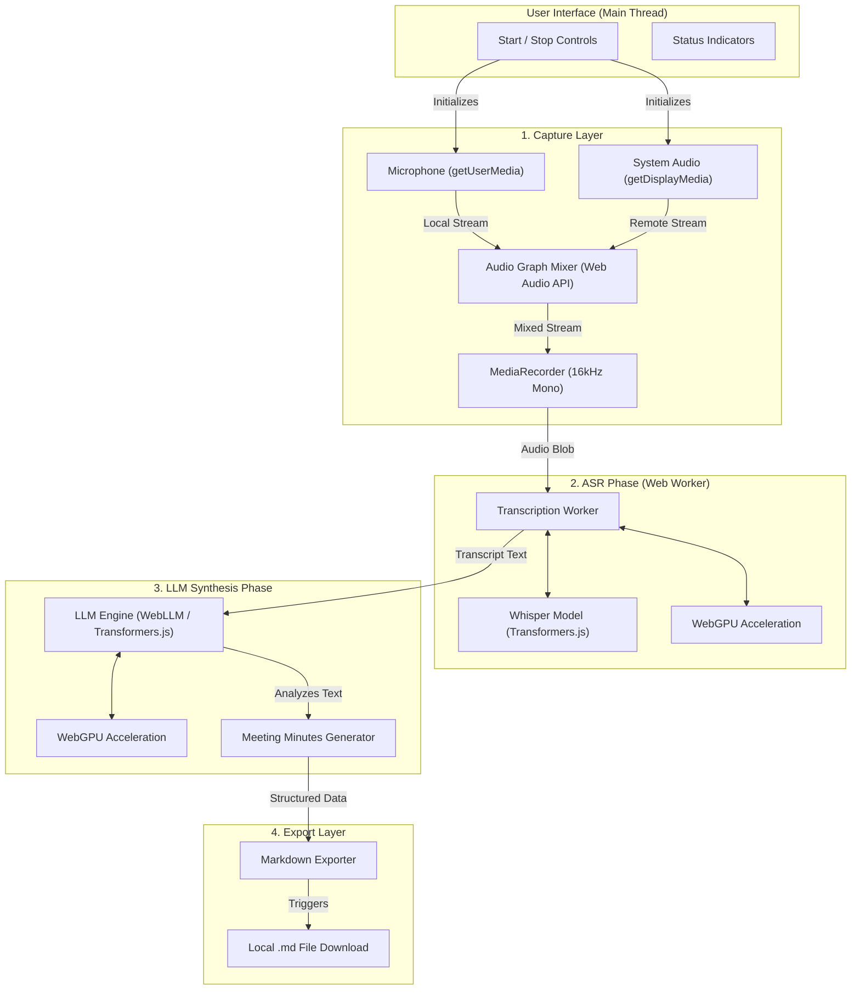
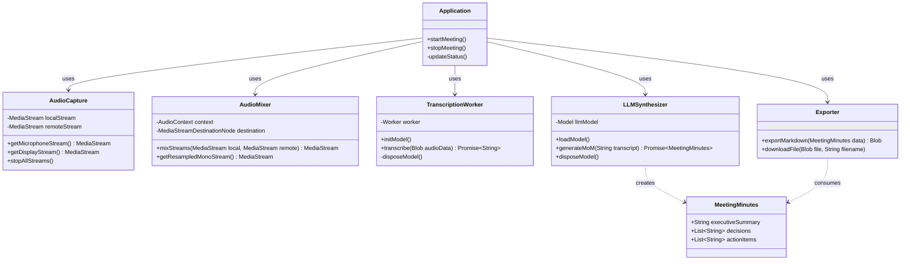
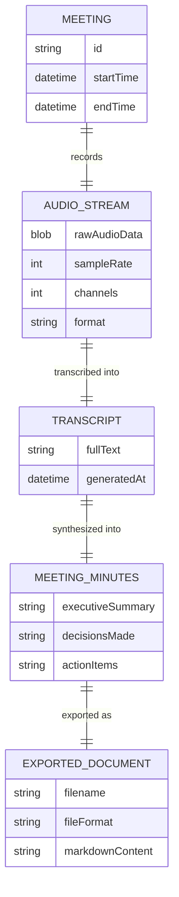

# RecallOS Architecture

This document outlines the technical architecture of **RecallOS**, the browser-native, offline AI meeting assistant. It includes the High-Level System Architecture, Class Diagram, and Entity-Relationship (ER) Diagram representing the internal data flow, as the system operates entirely client-side without a traditional database.

## 1. System Architecture (UML Component/Flow Diagram)

RecallOS follows a strict sequential execution pipeline to optimize for consumer hardware. The entire process—from audio capture to model inference—happens securely within the browser.

## 2. Class Diagram

The following class diagram models the core modules responsible for handling different phases of the RecallOS pipeline, based on the project structure (e.g., `lib/audio/capture.ts`, `lib/audio/mixer.ts`, `lib/worker/transcription.worker.ts`, `lib/synthesis/llm.ts`, `lib/utils/exporter.ts`).

## 3. Entity Relationship (ER) Diagram

Although RecallOS operates entirely client-side without a backend or persistent database, we can represent the logical data entities that are created, transformed, and passed between modules during the meeting lifecycle.

